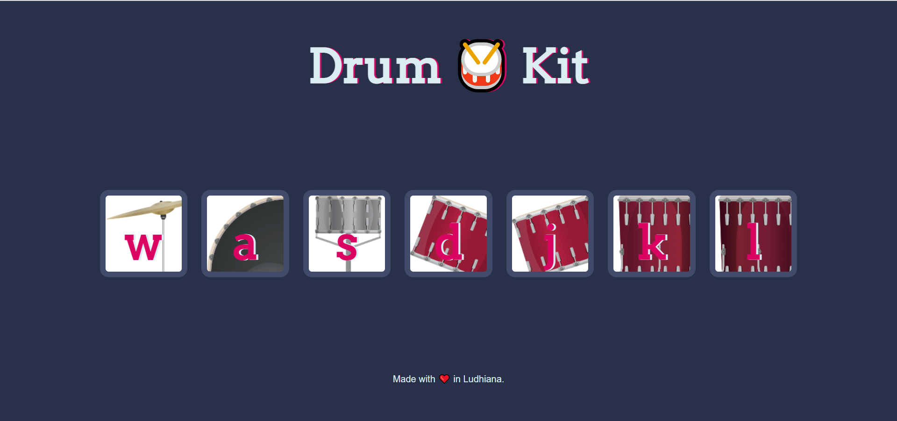

# A-Simple-Drum-Kit-App
Create your own drum music with this app

Here we have 7 buttons w,a,s,d,j,k,l each corresponding to some drum tone. We can play them either by pressing the corresponding button or by clicking

